# arc42 Architecture Documentation — tct (Terminal Card Tracker)

**Version:** 0.1.0
**Date:** 2026-05-14
**Status:** Living document

---

## 1. Introduction and Goals

### 1.1 Requirements Overview

tct is a keyboard-driven terminal user interface (TUI) Kanban board application written in Rust. It provides Trello-like functionality entirely within a terminal, targeting developers and power users who prefer keyboard-centric workflows.

**Core functional requirements:**

| ID | Requirement | Priority |
|----|-------------|----------|
| FR-1 | Multiple boards with CRUD operations | Must |
| FR-2 | Lists (columns) per board, reorderable | Must |
| FR-3 | Cards with title, description, checklist, labels, due date | Must |
| FR-4 | Keyboard-only navigation and editing | Must |
| FR-5 | Card movement within and across lists | Must |
| FR-6 | Inline Markdown description editor with syntax highlighting | Should |
| FR-7 | Search across cards (substring and regex) | Should |
| FR-8 | Card/board archiving and restoration | Should |
| FR-9 | CLI interface for scripting and AI agent use | Should |
| FR-10 | Periodic filesystem reload for background sync | Could |
| FR-11 | Per-board accent colors with auto-generated pastels | Could |
| FR-12 | Label management with color auto-differentiation | Should |

### 1.2 Quality Goals

| Priority | Quality Goal | Description |
|----------|-------------|-------------|
| 1 | Responsiveness | Sub-frame input latency; no blocking I/O on the main thread |
| 2 | Data safety | All writes are atomic (write-tmp-then-rename); no partial writes |
| 3 | Simplicity | Single binary, zero external services, no database |
| 4 | Keyboard efficiency | Every action reachable via keyboard, minimal keystrokes |
| 5 | Portability | Runs on macOS, Linux, Windows via crossterm |

### 1.3 Stakeholders

| Role | Expectations |
|------|-------------|
| Developer / Power user | Fast, keyboard-driven task management without leaving terminal |
| Automation / AI agent | Scriptable CLI for programmatic board manipulation |
| Team members (via shared fs) | Background sync via periodic filesystem reload |

---

## 2. Architecture Constraints

### 2.1 Technical Constraints

| Constraint | Rationale |
|-----------|-----------|
| Rust (2024 edition) | Performance, safety, single-binary distribution |
| No external services | Offline-first, zero deployment overhead |
| JSON file storage | Human-readable, git-friendly, no database dependency |
| Terminal-only UI | Target audience lives in terminals; no web/GUI |
| Atomic file writes | Data integrity on crash/power loss |

### 2.2 Organizational Constraints

| Constraint | Rationale |
|-----------|-----------|
| Single developer | Architecture must remain simple and maintainable |
| MIT License | Open source, minimal restrictions |

### 2.3 Conventions

| Convention | Details |
|-----------|---------|
| ID format | 8-char hex prefix of UUID v4 |
| File naming | `board.json` (incl. list defs), `card-<id>.json` |
| Storage resolution | `TCT_DATA_DIR` > `.tct/` ancestor walk > `~/.tct/` |
| Modal input | AppMode enum drives all input dispatch |

---

## 3. System Scope and Context

### 3.1 Business Context

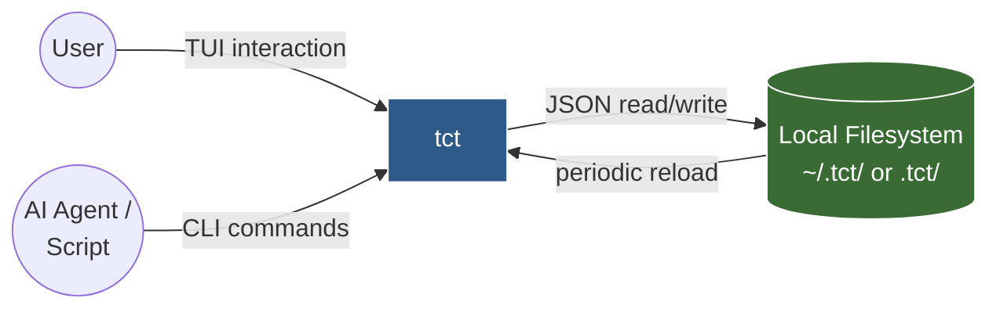

| Actor | Channel | Description |
|-------|---------|-------------|
| User | Terminal (stdin/stdout) | Interactive TUI with modal keyboard input |
| AI Agent / Script | CLI (argv/stdout) | Headless CLI subcommands for CRUD operations |
| Filesystem | JSON files | Persistent storage, also serves as sync mechanism |

### 3.2 Technical Context

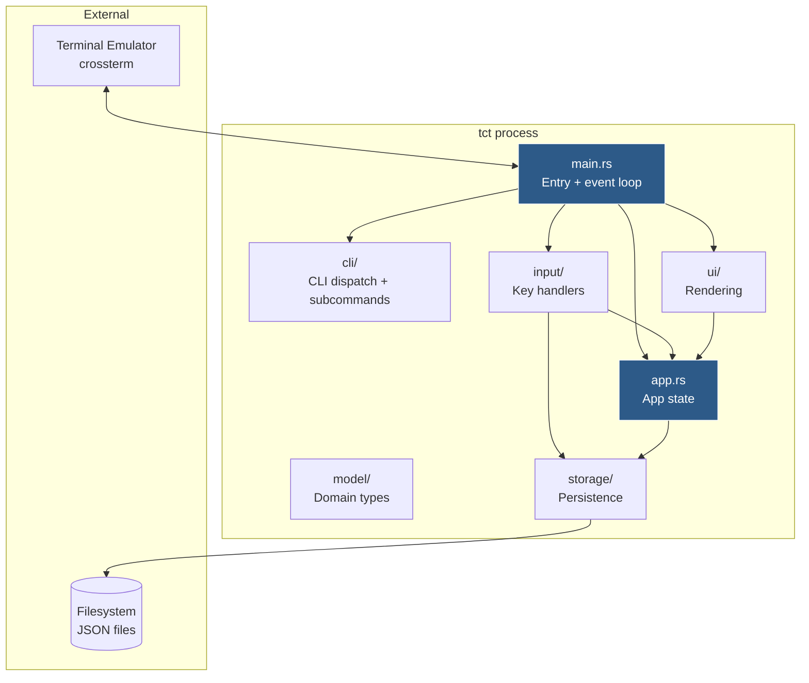

---

## 4. Solution Strategy

| Decision | Rationale |
|----------|-----------|
| **Modal input architecture** | Mirrors Vim-style UX; each mode has isolated input handler, prevents accidental actions |
| **Immediate-mode rendering** | Full re-render each frame via ratatui; simple, no widget state management |
| **File-per-entity storage** | Each card/list/board is a separate JSON file; enables concurrent access and granular diffs |
| **Atomic writes** | Write to `.tmp` then rename; prevents corruption on crash |
| **Single-threaded event loop** | Crossterm polling with 250ms tick; simple, sufficient for TUI perf |
| **Dual interface (TUI + CLI)** | Same storage layer serves both; CLI enables automation |
| **Type-driven modes** | `AppMode` enum drives dispatch; `Dialog` / `InsertHandler` traits make each dialog/insert target a self-contained struct (ADR-0003) |
| **Single mutation chokepoint** | All domain writes go through the `Command` enum applied by the Board Editor aggregate (ADR-0001/0002) |

---

## 5. Building Block View

### 5.1 Level 1 — Top-Level Decomposition

```mermaid
graph TB
    subgraph "tct"
        direction TB
        ENTRY["main.rs<br><i>Entry point, CLI dispatch, TUI event loop</i>"]
        subgraph "cli/"
            CLI_MOD["mod.rs<br>dispatch + help text"]
            CLI_BOARDS["boards.rs"]
            CLI_LISTS["lists.rs"]
            CLI_CARDS["cards.rs"]
            CLI_CHECKLIST["checklist.rs"]
            CLI_LABELS["labels.rs"]
            CLI_SEARCH["search.rs"]
            CLI_LOOKUP["lookup.rs<br>id/name resolution"]
            CLI_UTIL["util.rs<br>flags + formatting"]
        end
        APP_MOD["app.rs<br><i>App state, modes, board loading</i>"]
        EDITOR["board_editor.rs<br><i>Aggregate root for open board (ADR-0001/0002)</i>"]
        DIRECTORY["board_directory.rs<br><i>Board collection ops (ADR-0004)</i>"]
        COMMAND["command.rs<br><i>Command enum — mutation chokepoint (ADR-0002)</i>"]

        subgraph "model/"
            BOARD_M["board.rs<br>BoardMeta, ListMeta"]
            CARD_M["card.rs<br>Card, ChecklistItem"]
            LIST_M["list.rs<br>CardList (derived) + build_lists"]
            LABEL_M["label.rs<br>Label, LabelColor"]
            IDS_M["ids.rs<br>ShortId"]
        end

        subgraph "storage/"
            BOARD_S["board_store.rs<br>Board CRUD + ordering"]
            MIGRATE_S["migrate.rs<br>legacy list-file migration"]
            CARD_S["card_store.rs<br>Card CRUD + load_all_cards"]
            PATHS_S["paths.rs<br>Path resolution"]
            STORE_MOD["mod.rs<br>StorageError, atomic_write"]
        end

        subgraph "input/"
            INPUT_MOD["mod.rs<br>Input dispatch by AppMode"]
            KEYMAP_I["keymap.rs<br>Binding table + lookup + help_rows (ADR-0005)"]
            NORMAL_I["normal.rs<br>Board view keys"]
            DETAIL_I["card_detail_input.rs<br>Card detail keys"]
            INSERT_I["insert.rs<br>Insert dispatch to active InsertHandler"]
            DIALOG_I["dialog_input.rs<br>Dialog dispatch + side effects"]
            BSEL_I["board_selector_input.rs<br>Board selector keys"]
            CMD_I["command.rs<br>Search command"]
        end

        subgraph "insert/ (ADR-0003)"
            INS_MOD["mod.rs<br>InsertHandler trait + InsertOutcome"]
            INS_LINE["line_editor.rs<br>single-line inputs"]
            INS_MD["markdown_editor.rs<br>desc editor: autocontinue / nest"]
            INS_DATE["date_picker.rs<br>due-date picker"]
        end

        subgraph "dialog/ (ADR-0003)"
            DLG_MOD["mod.rs<br>Dialog trait + DialogOutcome"]
            DLG_STRUCTS["confirm_* / label_picker / label_manager<br>archived_* / card_history / color_picker"]
        end

        subgraph "ui/"
            UI_MOD["mod.rs<br>Render dispatch + help overlay"]
            BSEL_UI["board_selector.rs<br>Board list screen"]
            BVIEW_UI["board_view.rs<br>Board columns"]
            CDETAIL_UI["card_detail.rs<br>Card detail overlay"]
            DIALOG_UI["dialog.rs<br>Confirmation + picker dialogs"]
            SEARCH_UI["search_bar.rs<br>Search input"]
            STATUS_UI["status_bar.rs<br>Mode hints + status"]
            MD_UI["markdown.rs<br>Markdown highlighting"]
            THEME_UI["theme.rs<br>Color constants"]
            subgraph "widgets/"
                CARD_W["card_widget.rs<br>Card rendering"]
                LIST_W["list_widget.rs<br>List column rendering"]
            end
        end

        EVENT["event.rs<br>EventHandler (crossterm polling)"]
    end

    ENTRY --> CLI_MOD
    ENTRY --> APP_MOD
    ENTRY --> EVENT
    ENTRY --> INPUT_MOD
    ENTRY --> UI_MOD
    APP_MOD --> EDITOR
    EDITOR --> COMMAND
    EDITOR --> BOARD_S
    EDITOR --> CARD_S
    DIRECTORY --> BOARD_S
    BOARD_S --> MIGRATE_S
    INPUT_MOD --> APP_MOD
    INPUT_MOD --> EDITOR
    INPUT_MOD --> DIRECTORY
    UI_MOD --> APP_MOD
```

Mutations flow `input/` → `Command` → `BoardEditor::apply` → stores; the editor
is the only path to disk for the open board, and `board_directory` is the only
path for board-collection operations (ADR-0001/0002/0004).

### 5.2 Level 2 — Module Responsibilities

#### model/ — Domain Types (Pure Data)

| Module | Types | Purpose |
|--------|-------|---------|
| `board.rs` | `BoardMeta` | Board identity, name, list ordering, labels, accent color, archive flag |
| `card.rs` | `Card`, `ChecklistItem` | Card data: `list_id`, `position`, title, description, labels, due date, checklist, archive flag |
| `list.rs` | `CardList` | Derived in-memory view of a list; `build_lists`/`ordered_card_ids` assemble it from `ListMeta` + cards |
| `label.rs` | `Label`, `LabelColor` | Label identity + color; HSL-based pastel generation |
| `ids.rs` | `ShortId` (= `String`) | 8-char UUID v4 prefix generator |

#### storage/ — Persistence Layer

| Module | Purpose |
|--------|---------|
| `paths.rs` | Resolves storage root: `TCT_DATA_DIR` > `.tct/` walk > `~/.tct/` |
| `board_store.rs` | Board CRUD, board ordering (separate `board_order.json`); triggers `migrate` on load |
| `migrate.rs` | One-time migration of legacy `list-*.json` boards to card-owned membership |
| `card_store.rs` | Card CRUD, `load_all_cards` scan, archived listing, JSON schema migration |
| `mod.rs` | `StorageError` enum, `atomic_write` helper |

#### input/ — Input Handling (Controller)

| Module | Mode(s) Handled |
|--------|----------------|
| `board_selector_input.rs` | `BoardSelector` |
| `normal.rs` | `Normal` (board view) |
| `card_detail_input.rs` | `CardDetail` |
| `keymap.rs` | Generic `Binding` table + `lookup`/`help_rows`, shared by the three table-driven modes (ADR-0005) |
| `insert.rs` | `Insert` — dispatches keys to the active `Box<dyn InsertHandler>` (handlers live in `src/insert/`) |
| `dialog_input.rs` | `Dialog` — dispatches to the active `Box<dyn Dialog>` and applies side effects (dialogs live in `src/dialog/`) |
| `command.rs` | `Command` (search bar) |

#### ui/ — Rendering (View)

| Module | Renders |
|--------|---------|
| `board_selector.rs` | Board list with accent colors |
| `board_view.rs` | Kanban columns layout |
| `card_detail.rs` | Card detail overlay + description editor |
| `dialog.rs` | Confirmation, label picker, label manager, archive dialogs |
| `search_bar.rs` | Search input bar |
| `status_bar.rs` | Mode indicators + keyboard hints |
| `markdown.rs` | Line-level Markdown syntax highlighting |
| `widgets/card_widget.rs` | Individual card rendering (title, labels, due, checklist progress) |
| `widgets/list_widget.rs` | List column with card stack |
| `widgets/date_picker.rs` | Calendar grid for the due-date picker |

---

## 6. Runtime View

### 6.1 TUI Event Loop

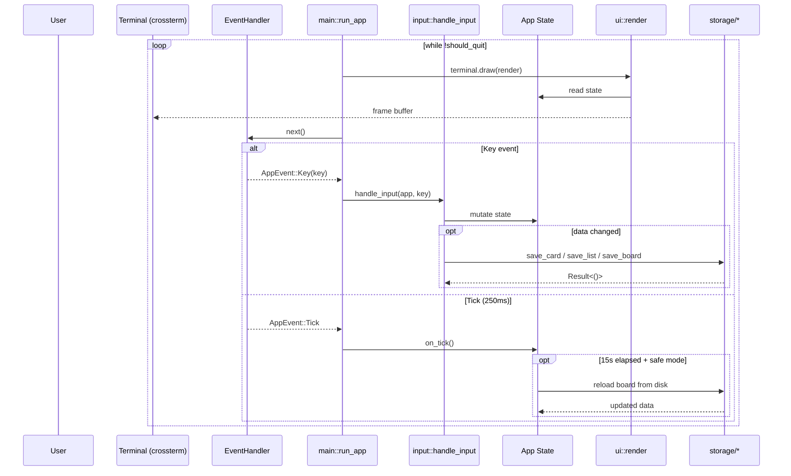

### 6.2 CLI Command Execution

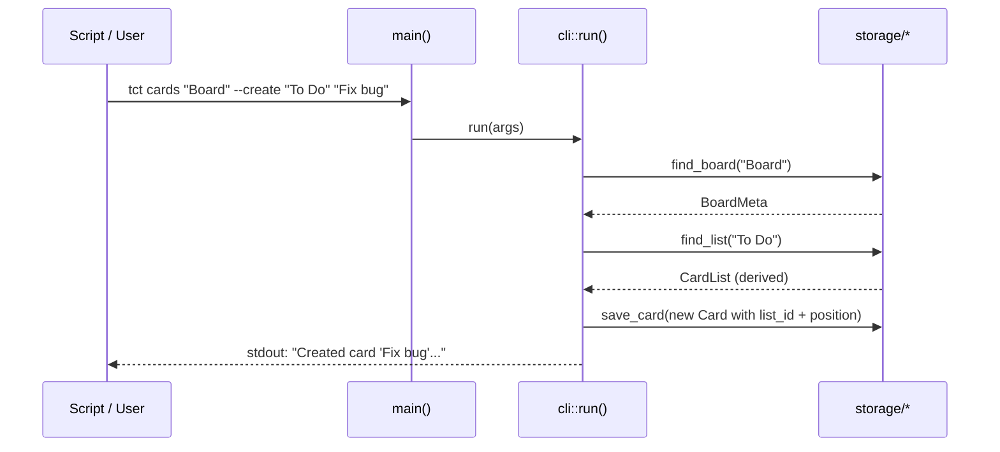

### 6.3 Modal Input State Machine

```mermaid
stateDiagram-v2
    [*] --> BoardSelector: startup

    BoardSelector --> Normal: Enter (open board)
    BoardSelector --> Insert_NewBoardName: n (new board)
    BoardSelector --> Dialog_ConfirmArchiveBoard: a (archive board)
    BoardSelector --> Dialog_ArchivedBoards: v (view archived)

    Insert_NewBoardName --> BoardSelector: Enter/Esc

    Normal --> CardDetail: Enter (open card)
    Normal --> Insert_NewCardTitle: n (new card)
    Normal --> Insert_EditCardTitleInline: e (quick edit)
    Normal --> Insert_NewListName: N (new list)
    Normal --> Insert_RenameList: r (rename list)
    Normal --> Dialog_ConfirmArchiveList: A (archive list)
    Normal --> Dialog_ConfirmArchiveCard: a (archive card)
    Normal --> Dialog_ArchivedCards: v (view archived)
    Normal --> Dialog_LabelManager: L (manage labels)
    Normal --> Command: / (search)
    Normal --> Help: ? (help)
    Normal --> BoardSelector: b (back)

    CardDetail --> Normal: Esc (close)
    CardDetail --> Insert_EditCardTitle: t (edit title)
    CardDetail --> Insert_EditCardDescription: e (edit desc)
    CardDetail --> Insert_NewChecklistItem: a (add item)
    CardDetail --> Insert_EditChecklistItem: Enter (edit item)
    CardDetail --> Insert_EditDueDate: u (set due date)
    CardDetail --> Dialog_LabelPicker: l (label picker)
    CardDetail --> Dialog_LabelManager: L (label manager)

    Command --> Normal: Enter/Esc

    Help --> Normal: Esc/q

    Dialog_ConfirmArchiveList --> Normal: y/n
    Dialog_ConfirmArchiveCard --> Normal: y/n
    Dialog_ConfirmArchiveBoard --> BoardSelector: y/n
    Dialog_ArchivedCards --> Normal: Esc
    Dialog_ArchivedBoards --> BoardSelector: Esc
    Dialog_LabelPicker --> CardDetail: Esc
    Dialog_LabelManager --> Normal: Esc
    Dialog_ConfirmCancelEdit --> CardDetail: y/n
    Dialog_ConfirmDeleteLabel --> Dialog_LabelManager: y/n

    Insert_EditCardTitle --> CardDetail: Enter/Esc
    Insert_EditCardDescription --> CardDetail: Ctrl+S/Esc
    Insert_NewChecklistItem --> CardDetail: Enter/Esc
    Insert_EditChecklistItem --> CardDetail: Enter/Esc
    Insert_EditDueDate --> CardDetail: Enter/Esc
    Insert_NewCardTitle --> Normal: Enter/Esc
    Insert_EditCardTitleInline --> Normal: Enter/Esc
    Insert_NewListName --> Normal: Enter/Esc
    Insert_RenameList --> Normal: Enter/Esc
```

---

## 7. Deployment View

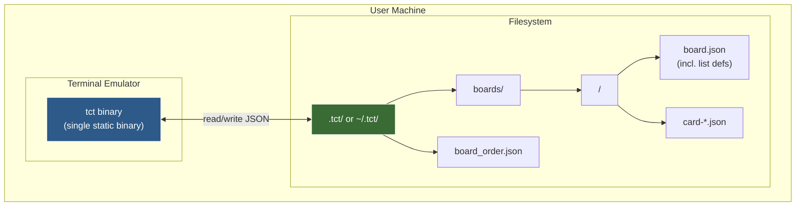

### 7.1 Installation

```sh
cargo install --path .   # Produces single binary: tct
```

### 7.2 Storage Location Resolution

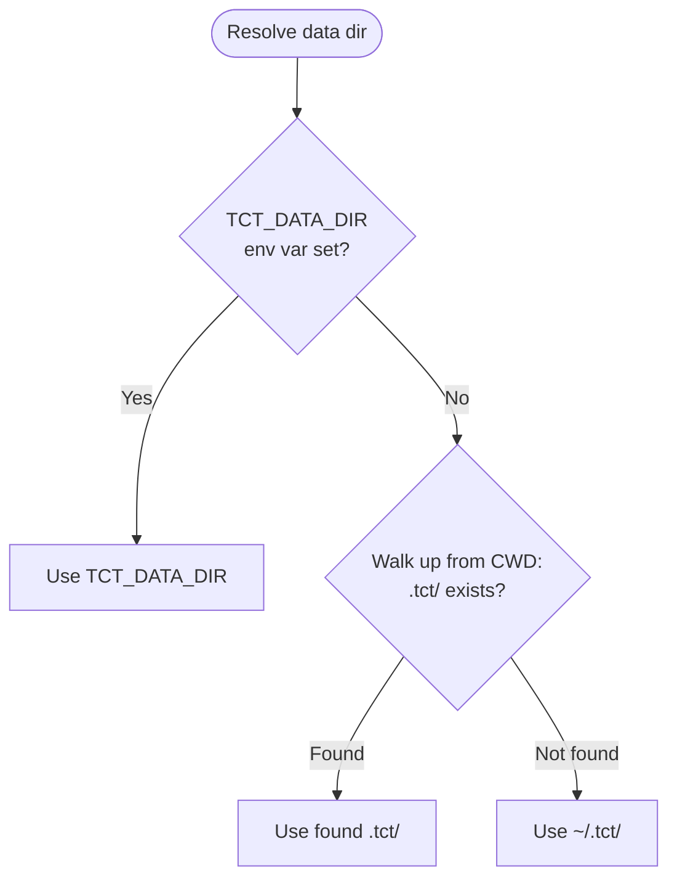

### 7.3 File Layout

```
.tct/                          # or ~/.tct/
  board_order.json             # JSON array of board IDs (display order)
  boards/
    a1b2c3d4/                  # Board directory (8-char ID)
      board.json               # BoardMeta: name, lists[] (id/name/archived), labels, accent_color
      card-11223344.json       # Card: list_id, position, title, description, checklist, label_ids, due_date
      card-55667788.json
    b2c3d4e5/                  # Another board
      board.json
      ...
```

---

## 8. Cross-cutting Concepts

### 8.1 Data Integrity — Atomic Writes

All file mutations go through `storage::atomic_write()`:

```
1. Write content to <path>.tmp
2. Rename <path>.tmp → <path>    (atomic on POSIX)
```

This ensures no partial writes are visible even on crash.

### 8.2 Modal Input Architecture

The `AppMode` enum is the single source of truth for what key handler and renderer are active:

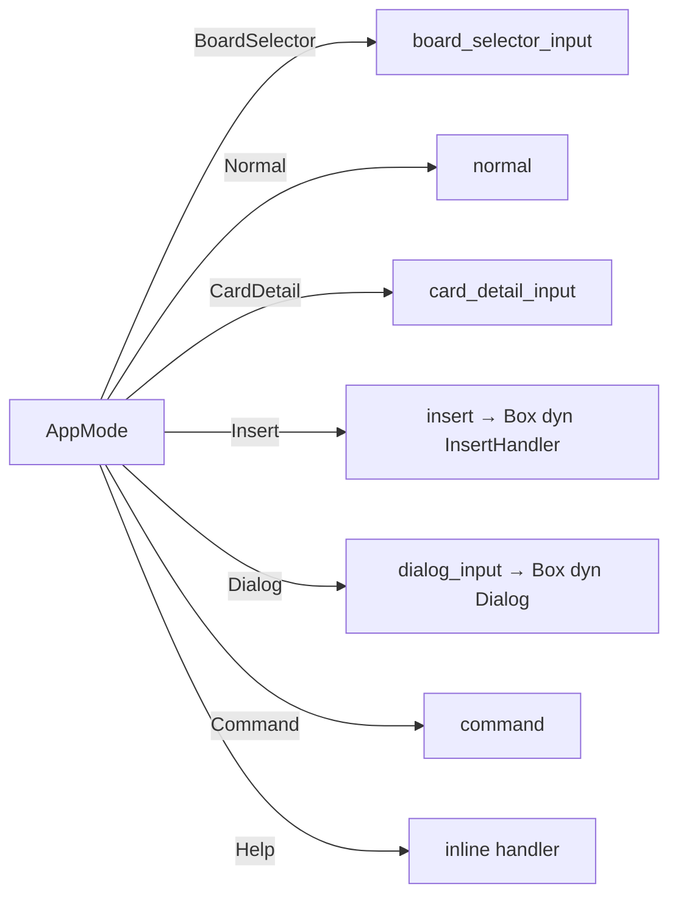

`Insert` and `Dialog` are parameterless modes: the active handler is a `Box<dyn InsertHandler>` / `Box<dyn Dialog>` stored on `App`, each a self-contained struct that owns its render, input handling, and state (ADR-0003). The other modes dispatch through per-mode keymap tables (ADR-0005).

### 8.3 ID Generation

IDs are 8-character hex strings: first 8 chars of a UUID v4. Compact for display, sufficient entropy for single-user local storage.

```rust
pub fn new_id() -> ShortId {
    uuid::Uuid::new_v4().to_string()[..8].to_string()
}
```

### 8.4 Label Color System

Labels use a `LabelColor` enum with 8 named pastel variants plus `Custom { r, g, b }`. New labels auto-generate maximally distant hues from existing labels using HSL color space:

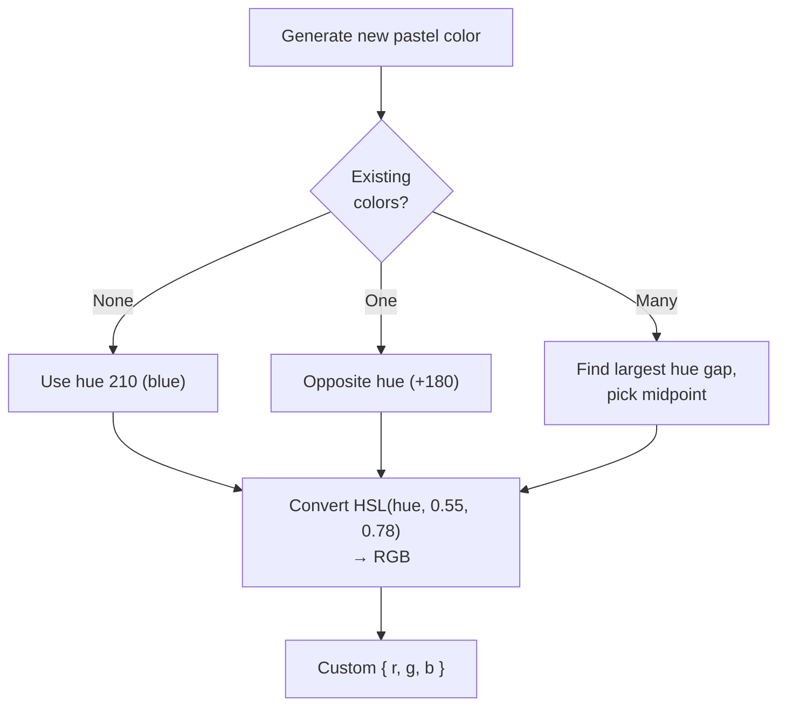

### 8.5 Search Architecture

- **TUI search:** Filters visible cards in real-time; non-matching cards are hidden (not dimmed), navigation skips them, first match auto-selected
- **CLI search:** Full-text search across all boards with optional board/list filters and regex support
- **Search targets:** Card title, description, checklist item text, label names

### 8.6 Periodic Reload

`App::on_tick()` reloads board data from the filesystem every 15 seconds (configurable via `reload_interval`). Reload is skipped during editing, dialog, or grab modes to prevent data loss. Selection state (selected list, card index, scroll offset) is preserved across reloads.

### 8.7 Data Migration

`card_store::load_card()` includes runtime migration for legacy JSON schemas:

| Migration | Old Format | New Format |
|-----------|-----------|------------|
| Checklist | `"checklists": [{title, items: [...]}]` | `"checklist": [ChecklistItem]` |
| Labels | `"labels": [{name, color}]` | `"label_ids": [ShortId]` (board-level labels) |

Migrated data is written back on load (lazy migration).

---

## 9. Architecture Decisions

The numbered, dated decision records live in [`docs/adr/`](adr/). Summary:

| ADR | Decision |
|-----|----------|
| [0001](adr/0001-board-editor-aggregate.md) | Board Editor aggregate root — the only write path to disk for the open board |
| [0002](adr/0002-command-enum-scope.md) | `Command` enum is the sole chokepoint for domain mutations |
| [0003](adr/0003-dialog-and-insert-as-traits.md) | `Dialog` / `InsertHandler` traits replace flat `DialogKind` / `InsertTarget` enums |
| [0004](adr/0004-board-directory.md) | Board Directory owns board-collection operations |
| [0005](adr/0005-keymap-tables.md) | Keymap tables drive both dispatch and the help overlay |
| [0006](adr/0006-card-owned-list-membership.md) | Cards own their list membership (`list_id` + `position`); no `list-*.json` files |

Foundational decisions not captured as ADRs:

- **JSON files over SQLite** — human-readable, git-friendly diffs, no native linking; trade-off is no transactions/indexing and linear-scan search.
- **Single-threaded event loop** (250ms poll) — crossterm polling is non-blocking and all I/O is local; no async needed.
- **Immediate-mode rendering** — full re-render each frame via ratatui; no retained widget state to keep in sync.
- **Modal input** — Vim-style `AppMode` lets one key mean different things per mode and guards destructive actions.
- **Dual interface (TUI + CLI)** — single binary, shared storage layer; CLI enables scripting and AI-agent use.

---

## 10. Quality Requirements

### 10.1 Quality Tree

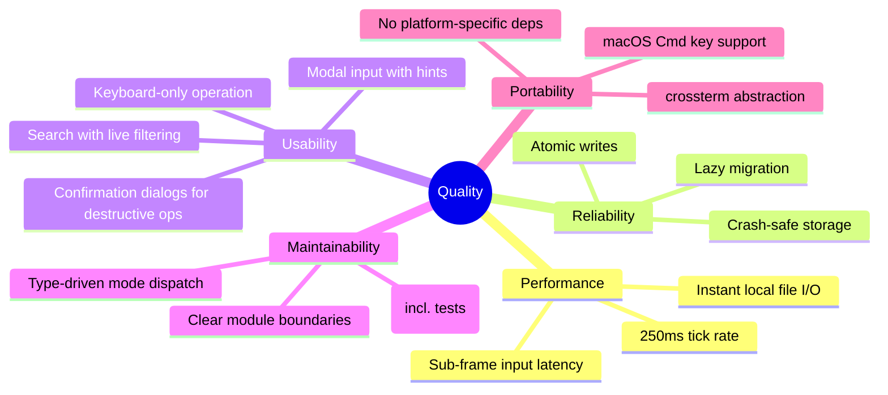

### 10.2 Quality Scenarios

| ID | Quality | Scenario | Metric |
|----|---------|----------|--------|
| QS-1 | Reliability | App crashes during card save | No data corruption (atomic write) |
| QS-2 | Usability | User presses wrong key in Normal mode | Destructive actions require confirmation dialog |
| QS-3 | Performance | User navigates 100+ cards on a board | Render completes within single frame |
| QS-4 | Portability | User runs on macOS with kitty terminal | Cmd+S works via `has_ctrl_or_cmd()` helper |
| QS-5 | Maintainability | Developer adds new card field | Follow documented 5-step recipe in CLAUDE.md |
| QS-6 | Data safety | Two tct instances access same board | Periodic reload (15s) picks up external changes |

---

## 11. Technical Risks and Debt

| Risk | Impact | Mitigation |
|------|--------|-----------|
| **No file locking** | Concurrent writes from TUI + CLI could race | Atomic writes limit corruption window; periodic reload detects external changes |
| **Linear search** | Search scans all cards across all boards | Acceptable for single-user local use; no index needed at expected scale |
| **8-char ID collisions** | ~1 in 4 billion; collision means data overwrite | Acceptable for single-user; UUIDs could be extended if needed |
| **No undo for destructive actions** | Deleted cards/lists are gone | Confirmation dialogs guard all destructive ops; archive as soft-delete |
| **Synchronous I/O on main thread** | Large boards could cause frame drops | Local FS is fast; could move to async if networked storage needed |
| **JSON schema evolution** | Old files may lack new fields | `serde(default)` on all optional fields + runtime migration in `card_store` |

---

## 12. Glossary

| Term | Definition |
|------|-----------|
| **Board** | Top-level container holding lists, labels, and an accent color. Stored as `BoardMeta`. |
| **List** | A column within a board. Defined by a `ListMeta` entry in `board.json`; its cards are those whose `list_id` matches, ordered by `position`. Assembled in memory as `CardList`. |
| **Card** | A task item with title, description, checklist, labels, due date, and archive flag. |
| **Label** | A board-level named tag with a color, assignable to cards via `label_ids`. |
| **ShortId** | 8-character hex string (UUID v4 prefix) used as unique identifier. |
| **AppMode** | Enum controlling which input handler and renderer are active. |
| **InsertHandler** | Trait; one struct per insert target owns its render + input + buffer state (ADR-0003). |
| **Dialog** | Trait; one struct per dialog kind owns its render + input + state (ADR-0003). |
| **Board Editor** | Aggregate root for the open board; only write path to disk (ADR-0001). |
| **Command** | Enum covering every domain mutation; applied via `BoardEditor::apply` (ADR-0002). |
| **Atomic write** | Write to `.tmp` then rename; ensures no partial file content. |
| **Accent color** | Per-board `LabelColor` used for all UI highlights instead of hardcoded Cyan. |
| **Pastel generation** | HSL-based algorithm that picks maximally distant hue from existing colors. |
| **Periodic reload** | `on_tick()` reloads board from filesystem every 15s for external-change detection. |
| **Card archiving** | Soft-delete: card's `archived` flag set to true, removed from list but file kept. |
