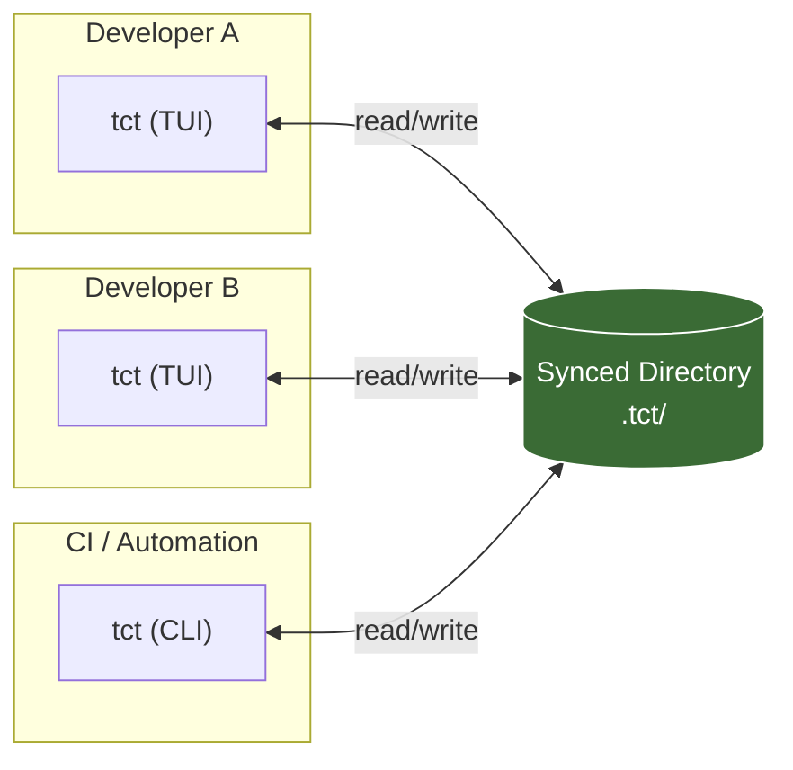
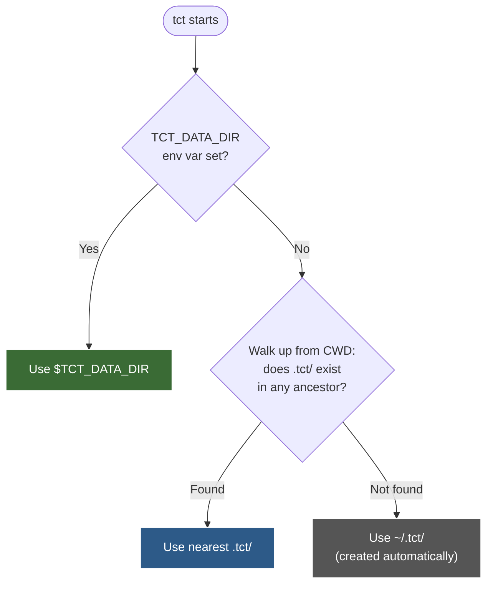
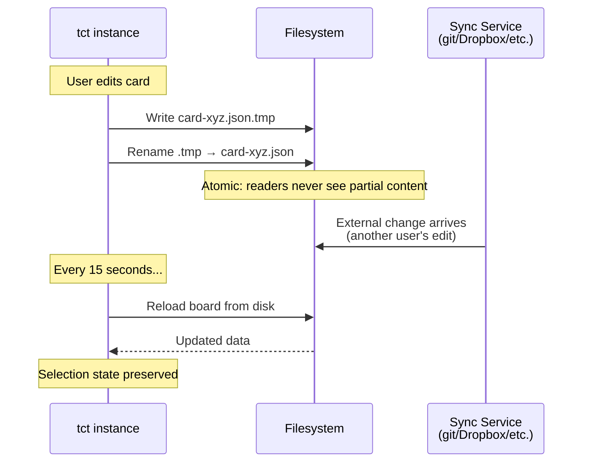
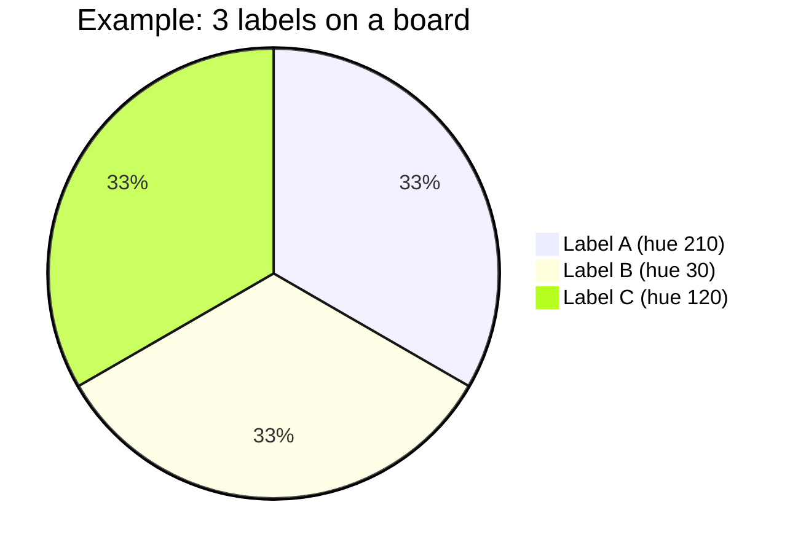
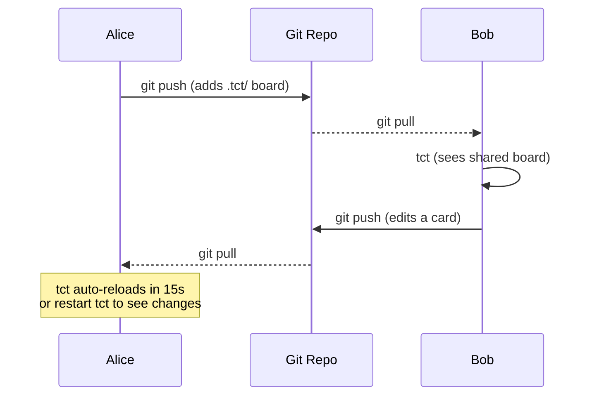

# tct User Guide — Terminal Card Tracker

## What is tct?

tct is a keyboard-driven Kanban board that lives in your terminal. It stores everything as plain JSON files on disk — no server, no database, no account.

This matters because it means tct boards are **just files**. Put them in a git repo, a Dropbox folder, or any synced directory and every team member sees the same boards. tct watches the filesystem and picks up changes automatically, making it a natural fit for **background file sync** workflows.



### Design Principles

| Principle | What it means |
|-----------|--------------|
| **Files are the API** | Every board, list, and card is a standalone JSON file. Any tool that can read/write files can interact with tct data. |
| **Sync-friendly by default** | One file per entity, atomic writes (write `.tmp` then rename), and periodic reload make tct safe for use with git, Dropbox, Syncthing, or any file sync tool. |
| **Keyboard-first** | Every action is reachable from the keyboard. No mouse needed. Modal input (like Vim) keeps keybindings contextual and safe. |
| **Dual interface** | The same data is accessible via interactive TUI or headless CLI. Scripts and AI agents use the CLI; humans use the TUI. Both read and write the same files. |
| **Zero infrastructure** | Single binary. No database. No network. Install and run. |

---

## Installation

### From source

```sh
git clone <repo-url>
cd tct
cargo install --path .
```

### Run without installing

```sh
cargo run
```

### Verify

```sh
tct --help
```

---

## Storage and Sync

### Where data lives

tct resolves its data directory in this order:



This means:

- **Global boards** live in `~/.tct/` — your personal default
- **Project-local boards** live in a `.tct/` directory inside (or above) your project — shared with anyone who clones the repo
- **Custom location** via `TCT_DATA_DIR` — useful for testing or pointing at a sync folder

### File layout

```
.tct/
  board_order.json                 # Display order of boards (JSON array of IDs)
  boards/
    a1b2c3d4/                      # One directory per board
      board.json                   # Board metadata: name, labels, accent color, list order
      list-e5f6a7b8.json           # List: name + ordered card IDs
      list-c9d0e1f2.json
      card-11223344.json           # Card: title, description, checklist, labels, due date
      card-55667788.json
    b2c3d4e5/                      # Another board
      board.json
      ...
```

Every entity (board, list, card) has its own file. This is deliberate:

- **Granular diffs** — changing one card produces a one-file diff, not a monolithic database change
- **Conflict-friendly** — two people editing different cards never conflict, even without locking
- **Human-readable** — open any `.json` file in an editor to inspect or fix data

### Setting up background sync

#### With git (recommended for teams)

```sh
# In your project root:
mkdir .tct
echo ".tct/**/*.tmp" >> .gitignore   # Exclude atomic-write temp files

# Use tct normally — boards are created inside .tct/
tct boards --create "Sprint Board"

# Commit and push
git add .tct/
git commit -m "Add project Kanban board"
git push
```

Team members who pull will see the board when they run `tct` from that project directory.

#### With Dropbox / Syncthing / OneDrive

```sh
# Option 1: Put .tct/ inside a synced folder
cd ~/Dropbox/my-project
mkdir .tct
cd ~/Dropbox/my-project && tct

# Option 2: Point TCT_DATA_DIR at a synced location
export TCT_DATA_DIR=~/Dropbox/shared-boards
tct
```

#### How sync safety works



Key safety properties:

| Property | Mechanism |
|----------|-----------|
| **No partial reads** | Atomic write: `.tmp` then rename. Readers always see complete files. |
| **No edit loss during reload** | Reload skipped while editing description, in dialogs, or in insert mode. |
| **Selection preserved** | List/card selection indices survive reload. |
| **No file locking needed** | One file per entity; only conflicting edits to the same card require manual merge. |

---

## TUI Quick Start

### Launch

```sh
tct                     # Open board selector
tct --board "Sprint"    # Open directly into a board (partial name match)
```

### Screens overview


### Board Selector

The first screen you see. Lists all active boards.

| Key | Action |
|-----|--------|
| Up / Down | Navigate boards |
| Shift+Up / Shift+Down | Reorder board in list |
| Enter | Open selected board |
| n | Create new board |
| r | Rename selected board |
| c | Cycle board accent color |
| a | Archive board (with confirmation) |
| v | View / restore archived boards |
| ? | Help overlay |
| q | Quit |

### Board View (Kanban columns)

The main working screen. Shows lists as columns with cards stacked vertically.

**Navigation:**

| Key | Action |
|-----|--------|
| Left / Right | Switch between lists |
| Up / Down | Navigate cards within a list |
| g | Jump to first card |
| G | Jump to last card |

**Card actions:**

| Key | Action |
|-----|--------|
| Enter | Open card detail view |
| t | Quick-edit card title (inline) |
| e | Edit card description |
| y | Copy card title to clipboard |
| n | Create new card in current list |
| a | Archive card (with confirmation) |
| h | View card change history |

**Card movement:**

| Key | Action |
|-----|--------|
| Shift+Up / Shift+Down | Move card up/down within list |
| Shift+Left / Shift+Right | Move card to adjacent list |

**List management:**

| Key | Action |
|-----|--------|
| N | Create new list |
| r | Rename current list |
| A | Archive list (with confirmation) |
| V | View / restore / delete archived lists |
| < (Shift+,) | Move list left |
| > (Shift+.) | Move list right |

**Labels & due dates:**

| Key | Action |
|-----|--------|
| l | Assign / remove labels (label picker) |
| L | Open label manager |
| u | Set due date (opens calendar picker) |
| U | Clear due date |

**Search & filter:**

| Key | Action |
|-----|--------|
| / | Open search bar |
| f | Filter by label |
| F | Clear all filters (search + label) |

**Other:**

| Key | Action |
|-----|--------|
| v | View / restore / delete archived cards |
| b | Back to board selector |
| ? | Help overlay |
| q | Quit |

### Card Detail View

A full overlay showing all card properties: title, description, checklist, labels, and due date.

| Key | Action |
|-----|--------|
| t | Edit title |
| e | Edit description (opens Markdown editor) |
| PgUp / PgDn | Scroll description |
| y | Copy description to clipboard |
| Y | Copy entire checklist as Markdown to clipboard |
| Up / Down | Navigate checklist items |
| Shift+Up / Shift+Down | Reorder selected checklist item |
| Space | Toggle checklist item done/undone |
| a | Add new checklist item |
| Enter | Edit selected checklist item text |
| x | Delete selected checklist item |
| l | Assign / remove labels (label picker) |
| L | Manage board labels (create, rename, recolor, reorder, delete) |
| u | Set due date (opens calendar picker) |
| U | Clear due date |
| h | View card change history |
| ? | Help overlay |
| Esc | Close card detail |
| q | Quit |

### Description Editor

A full Markdown editor with syntax highlighting. Supports headings, bold, italic, inline code, code blocks, lists, blockquotes, and strikethrough.

| Key | Action |
|-----|--------|
| Ctrl+S | Save description |
| Ctrl+Z | Undo |
| Ctrl+Y | Redo |
| Ctrl+B | Toggle bold (`**text**`) |
| Ctrl+I | Toggle italic (`*text*`) |
| Ctrl+K | Toggle inline code (`` `text` ``) |
| Ctrl+L | Insert list item (`- `) |
| Up / Down | Move by visual (wrapped) line |
| Enter | Auto-continue bullet / numbered list items; renumbers numbered runs |
| Tab | Nest the current list item one level deeper (3 spaces) |
| Shift+Tab | Un-nest the current list item one level |
| Esc | Cancel — prompts to confirm if changes exist |

On macOS, **Cmd** can substitute for Ctrl in terminals that support it (kitty, Alacritty, WezTerm).

### Search

Press `/` in board view to open the search bar. Type a query and press Enter.

- Non-matching cards are **hidden** (not dimmed)
- Navigation **skips** hidden cards
- First match is **auto-selected**
- Label-based filtering also supported via the label manager

Press `F` to clear all active filters.

---

## Labels

Labels are **board-level** — defined once per board, then assigned to cards. This means renaming or recoloring a label updates it everywhere.

### Creating labels

1. Press `L` in board view or card detail to open the label manager
2. Press `n` to create a new label
3. Type a name and press Enter
4. Color is auto-generated to be maximally distinct from existing labels

### Assigning labels to cards

1. Open a card (Enter) and press `l` to open the label picker
2. Navigate with Up/Down, press Space or Enter to toggle assignment
3. Press Esc to close

### Label colors

tct generates pastel colors automatically using HSL color space. Each new label picks the hue that is maximally distant from all existing label hues:



You can cycle through named color presets (Red, Orange, Yellow, Green, Blue, Purple, Pink, Cyan) in the label manager, or stick with auto-generated pastels.

### Label ordering

Labels display on cards in **board-level order** (the order shown in the label manager), not in assignment order. Reorder labels in the manager with Shift+Up/Down to control display priority.

---

## Due Dates

- Press `u` in card detail (or in board view, on the selected card) to open the calendar picker
- In the picker: arrow keys move by day/week, PgUp/PgDn jump months (Shift = year), `t` jumps to today, Home/End jump to first/last day of month
- Type digits and `-` to edit the date text directly (`YYYY-MM-DD`); the calendar reparses as you type
- Press Enter to save, Esc to cancel; clearing the buffer (Ctrl+U) and pressing Enter removes the due date
- Press `U` to clear the due date without opening the picker
- **Overdue** cards show a visual indicator in both the card list and detail view
- Due dates are visible in CLI output (`tct cards <board>`) and search results

---

## Board Accent Colors

Each board has a configurable accent color used for all UI highlights (selection, borders, headings). Press `c` in the board selector to cycle through pastel colors. New boards auto-generate a color that is distinct from existing boards.

---

## Archiving

Archiving is a **soft delete** — the data stays on disk but is hidden from normal views.

### Cards

| Action | How |
|--------|-----|
| Archive card | `a` in board view (with confirmation) |
| View archived cards | `v` in board view |
| Restore archived card | Select in archive view, press `Enter` |
| Permanently delete | Select in archive view, press `x` |

### Lists

| Action | How |
|--------|-----|
| Archive list | `A` in board view (with confirmation) |
| View archived lists | `V` in board view |
| Restore archived list | Select in archive view, press `Enter` |
| Permanently delete | Select in archive view, press `x` |

### Boards

| Action | How |
|--------|-----|
| Archive board | `a` in board selector (with confirmation) |
| View archived boards | `v` in board selector |
| Restore archived board | Select in archive view, press `Enter` |
| Permanently delete | Select in archive view, press `x` |

---

## CLI Reference

The CLI provides the same operations as the TUI, designed for scripting and AI agent integration.

### General pattern

```
tct <entity> <board> --<action> [args]
```

All name arguments use **case-insensitive partial matching** by default. Add `--by-id` anywhere to match by exact 8-character ID instead.

### Boards

```sh
tct boards                          # List active boards with card counts
tct boards --archived               # List archived boards
tct boards --create "Sprint 42"     # Create a new board
tct boards --archive "Sprint"       # Archive (partial name match)
tct boards --restore "Sprint"       # Restore from archive
tct boards --delete "Sprint"        # Permanently delete (must be archived first)
```

### Lists

```sh
tct lists "Sprint"                            # List all lists on board
tct lists "Sprint" --create "To Do"           # Create a list
tct lists "Sprint" --rename "To Do" "Backlog" # Rename a list
tct lists "Sprint" --delete "Backlog"         # Delete list + all cards
```

### Cards

```sh
tct cards "Sprint"                                    # List all cards by list
tct cards "Sprint" --list "To Do"                     # Cards in specific list
tct cards "Sprint" --archived                         # List archived cards
tct cards "Sprint" --show "Fix bug"                   # Full card detail
tct cards "Sprint" --create "To Do" "Fix login bug"   # Create card
tct cards "Sprint" --edit "Fix login" --title "Fix login flow"  # Edit title
tct cards "Sprint" --edit "Fix login" --due 2026-06-01          # Set due date
tct cards "Sprint" --edit "Fix login" --due none                # Clear due date
tct cards "Sprint" --edit "Fix login" --description "New desc"  # Set description
tct cards "Sprint" --archive "Fix login"              # Archive
tct cards "Sprint" --restore "Fix login"              # Restore
tct cards "Sprint" --delete "Fix login"               # Permanently delete
```

### Checklist

```sh
tct checklist "Sprint" "Fix login"                    # Show checklist
tct checklist "Sprint" "Fix login" --add "Write test" # Add item
tct checklist "Sprint" "Fix login" --toggle 1         # Toggle item 1
tct checklist "Sprint" "Fix login" --delete 2         # Delete item 2
```

### Labels

```sh
tct labels "Sprint"                                   # List all labels
tct labels "Sprint" --create "bug"                    # Create label
tct labels "Sprint" --delete "bug"                    # Delete (removes from all cards)
tct labels "Sprint" --assign "Fix login" "bug"        # Assign to card
tct labels "Sprint" --remove "Fix login" "bug"        # Remove from card
```

### Search

```sh
tct search "login"                            # Search all boards
tct search "login" --board "Sprint"           # Limit to one board
tct search "login" --board "A" --board "B"    # Multiple board filters
tct search "login" --list "To Do"             # Limit to lists matching name
tct search "login|auth" --regex               # Regex search
tct search "old task" --archived              # Include archived cards
```

Search matches against: card title, description, checklist item text, and label names.

### Using IDs

When name matching is ambiguous (multiple matches), tct shows all candidates with their IDs:

```
Error: Multiple cards match 'fix': Fix login [a1b2c3d4], Fix signup [e5f6a7b8].
```

Use `--by-id` to match by exact ID:

```sh
tct cards "Sprint" --show a1b2c3d4 --by-id
```

---

## Workflows

### Solo developer — project-local board

```sh
cd ~/projects/my-app
mkdir .tct
echo ".tct/**/*.tmp" >> .gitignore

tct boards --create "My App"
tct lists "My App" --create "To Do"
tct lists "My App" --create "In Progress"
tct lists "My App" --create "Done"

# Work in TUI
tct --board "My App"
```

### Team — shared boards via git



Best practices for git-synced boards:

1. Add `.tct/**/*.tmp` to `.gitignore`
2. Commit `.tct/` along with code changes
3. Different team members should avoid editing the **same card** simultaneously — different cards are conflict-free
4. If a merge conflict occurs, pick either version (each file is self-contained)

### CI / Automation — CLI scripting

```sh
#!/bin/bash
# Create a card for each failing test
tct boards --create "CI Results" 2>/dev/null
tct lists "CI Results" --create "Failures" 2>/dev/null

for test in $(cat failing_tests.txt); do
    tct cards "CI Results" --create "Failures" "FAIL: $test"
done
```

### AI agent integration

The CLI's partial-name matching and `--by-id` mode make it suitable for LLM/AI agent workflows:

```sh
# Agent creates a task
tct cards "Sprint" --create "To Do" "Implement caching layer"

# Agent adds details
tct cards "Sprint" --edit "caching" --description "Add Redis caching for /api/users endpoint"
tct checklist "Sprint" "caching" --add "Set up Redis connection"
tct checklist "Sprint" "caching" --add "Add cache middleware"
tct checklist "Sprint" "caching" --add "Write integration tests"

# Agent marks progress
tct checklist "Sprint" "caching" --toggle 1
```

---

## Troubleshooting

### tct uses wrong data directory

Check which directory tct resolves:

1. Is `TCT_DATA_DIR` set? → `echo $TCT_DATA_DIR`
2. Is there a `.tct/` directory in the current directory or any parent? → `ls -la .tct/`
3. Otherwise it falls back to `~/.tct/`

### Changes from another user don't appear

tct reloads from disk every 15 seconds, but only in safe modes (board view, card detail, help). If you're in the middle of editing, reload is paused to prevent data loss. Close any editor/dialog and wait up to 15 seconds, or restart tct.

### Merge conflict in .tct/ files

Each file is self-contained JSON. For card conflicts: pick one version (or merge the JSON manually). For `board.json` conflicts: the `list_order` array may need manual merging if both sides added/reordered lists.

### Card or list missing after sync

Check if the file exists on disk:

```sh
ls .tct/boards/*/card-*.json
```

If a card file exists but isn't referenced in any list's `card_ids`, it's orphaned. Add its ID to the appropriate `list-*.json` file.

### macOS Cmd key not working

Cmd key support requires a terminal that sends Super modifier events. Supported: kitty, Alacritty, WezTerm. Not supported: Terminal.app, iTerm2 (use Ctrl instead).

---

## Appendix: Data Formats

### board.json

```json
{
  "id": "a1b2c3d4",
  "name": "Sprint 42",
  "description": "",
  "list_order": ["e5f6a7b8", "c9d0e1f2"],
  "labels": [
    { "id": "11112222", "name": "bug", "color": "red" },
    { "id": "33334444", "name": "feature", "color": { "custom": { "r": 170, "g": 200, "b": 255 } } }
  ],
  "accent_color": { "custom": { "r": 186, "g": 255, "b": 186 } },
  "archived": false,
  "created_at": "2026-05-01T10:00:00Z",
  "updated_at": "2026-05-14T15:30:00Z"
}
```

### list-\<id\>.json

```json
{
  "id": "e5f6a7b8",
  "name": "To Do",
  "card_ids": ["55667788", "99aabbcc"]
}
```

### card-\<id\>.json

```json
{
  "id": "55667788",
  "title": "Fix login bug",
  "description": "Auth token expires too early.\n\n## Steps to reproduce\n1. Login\n2. Wait 5 minutes\n3. Token is invalid",
  "label_ids": ["11112222"],
  "due_date": "2026-06-01",
  "checklist": [
    { "text": "Reproduce issue", "completed": true },
    { "text": "Write failing test", "completed": false },
    { "text": "Fix token expiry logic", "completed": false }
  ],
  "archived": false,
  "created_at": "2026-05-01T10:00:00Z",
  "updated_at": "2026-05-14T15:30:00Z"
}
```

### board_order.json

```json
["a1b2c3d4", "b2c3d4e5", "f7g8h9i0"]
```
